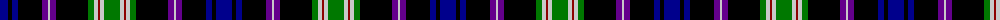

The parent of this is [MacKusick (Name)](/tartans/db/16/k4/db6/k24/p6/n2/p6/k32/g6/n4/dr2/n4/g/16/)

This was sourced from tartans-authority.  It is a [13 stripes tartan](/stripes/stripes13/).

Original link http://www.tartansauthority.com/tartan-ferret/display/2143/

## Thread count
DB/16 K4 DB6 K24 P6 N2 P6 K32 G6 N4 DR2 N4 G/16

## Palette
Each colour and its ΔE from the base-6 reference it is a variant of.

| Colour | Shade | Base | ΔE (OKLab) |
|---|---|---|---|
| DB |  `#00008C` | B  | 0.13 |
| DR |  `#8C0000` | R  | 0.13 |
| G |  `#007800` | G  | 0.06 |
| K |  `#000000` | K  | 0.00 |
| N |  `#C8C8C8` | W  | 0.13 |
| P |  `#64008C` | B  | 0.13 |

ID: /variants/db/16/k4/db6/k24/p6/n2/p6/k32/g6/n4/dr2/n4/g/16-db00008c-dr8c0000-g007800-k000000-nc8c8c8-p64008c/
