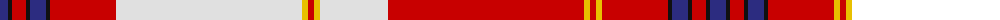

The parent of this is [Unidentified Tartan Tartan Number: 351. Earliest known date: Elgin Sent from Canada. See file. See products available Copyright © Blair Urquhart, Comrie, 2015](/tartans/db/16/k4/r14/k4/db16/k4/r66/ln186/y6/r6/y6/ln68/r196/y6/r6/y6/r66/k4/db16/k4/r14/k4/db/16/)

This was sourced from house-of-tartan.  It is a [23 stripes tartan](/stripes/stripes23/).

Original link http://www.house-of-tartan.scotland.net/house/TartanViewjs.asp?colr=Def&tnam=351

## Thread count
DB/16 K4 R14 K4 DB16 K4 R66 LN186 Y6 R6 Y6 LN68 R196 Y6 R6 Y6 R66 K4 DB16 K4 R14 K4 DB/16

## Palette
Each colour and its ΔE from the base-6 reference it is a variant of.

| Colour | Shade | Base | ΔE (OKLab) |
|---|---|---|---|
| DB |  `#2C2C80` | B  | 0.05 |
| K |  `#101010` | K  | 0.17 |
| LN |  `#E0E0E0` | W  | 0.06 |
| R |  `#C80000` | R  | 0.00 |
| Y |  `#E8C000` | Y  | 0.00 |

ID: /variants/db/16/k4/r14/k4/db16/k4/r66/ln186/y6/r6/y6/ln68/r196/y6/r6/y6/r66/k4/db16/k4/r14/k4/db/16-db2c2c80-k101010-lne0e0e0-rc80000-ye8c000/
