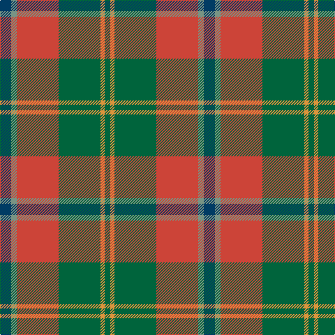

The parent of this is [Hutcheson Clan/Family Tartan Tartan Number: 3808. Earliest known date: 2000 After 46 years in the Scottish Textile industry and there being no Hutcheson tartan, Colin Hutcheson decided to produce this design to mark his and four generations of his family's involvement in spinning, weaving, knitting and clothing manufacture in Edinburgh and the Scottish Borders. The design is based on Douglas which is traditionally the closest clan to Hawick where he started his career in 1956. The colours were assembled from some of the most successful shades in the Johnstons of Elgin colour palette. Cloth can be obtained from Johnstons of Elgin. Any related names are welcome to wear the tartan - Hutcheon, Hutchison, Hutchieson, Hutchenson, Hutchinson, Hughson, MacCutcheon, MacCutchin, MacCutchan, MacCuthan, MacCutheon, MacCuthon. See products available Copyright © Blair Urquhart, Comrie, 2015](/tartans/db/16/lg8/r60/g60/o6/g/8/)

This was sourced from house-of-tartan.  It is a [6 stripes tartan](/stripes/stripes6/).

Original link http://www.house-of-tartan.scotland.net/house/TartanViewjs.asp?colr=Def&tnam=3808

## Thread count
DB/16 LG8 R60 G60 O6 G/8

## Palette
Each colour and its ΔE from the base-6 reference it is a variant of.

| Colour | Shade | Base | ΔE (OKLab) |
|---|---|---|---|
| DB |  `#003C64` | B  | 0.07 |
| G |  `#00643C` | G  | 0.06 |
| LG |  `#789484` | G  | 0.23 |
| LR |  `#EC34C4` | R  | 0.24 |
| O |  `#DC943C` | Y  | 0.12 |
| R |  `#CC4438` | R  | 0.07 |

# Sample pattern

ID: /variants/db/16/lg8/r60/g60/o6/g/8-db003c64-g00643c-lg789484-lrec34c4-odc943c-rcc4438/
