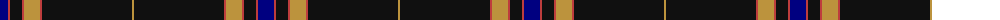

The parent of this is [degli Uberti, Baron of Cartsburn (Personal)](/tartans/db/16/r2/k12/r2/do16/r2/k90/do/2/)

This was sourced from register-of-tartans.  It is a [8 stripes tartan](/stripes/stripes8/).

Original link https://www.tartanregister.gov.uk/tartanDetails.aspx?ref=10635

## Thread count
DB/16 R2 K12 R2 DO16 R2 K90 DO/2

## Palette
Each colour and its ΔE from the base-6 reference it is a variant of.

| Colour | Shade | Base | ΔE (OKLab) |
|---|---|---|---|
| DB |  `#000080` | B  | 0.14 |
| DO |  `#BC933D` | Y  | 0.15 |
| K |  `#101010` | K  | 0.17 |
| R |  `#BE3D3D` | R  | 0.06 |

# Sample pattern

ID: /variants/db/16/r2/k12/r2/do16/r2/k90/do/2-db000080-dobc933d-k101010-rbe3d3d/
