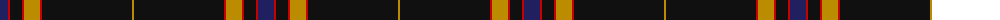
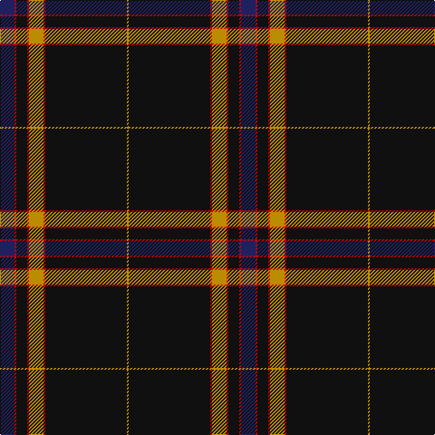

The parent of this is [degli Uberti, Baron of Cartsburn (P)](/tartans/db/16/r2/k12/r2/dy16/r2/k90/dy/2/)

This was sourced from tartans-authority.  It is a [8 stripes tartan](/stripes/stripes8/).

Original link http://www.tartansauthority.com/tartan-ferret/display/10635/

## Thread count
DB/16 R2 K12 R2 DY16 R2 K90 DY/2

## Palette
Each colour and its ΔE from the base-6 reference it is a variant of.

| Colour | Shade | Base | ΔE (OKLab) |
|---|---|---|---|
| DB |  `#202060` | B  | 0.11 |
| DY |  `#BC8C00` | Y  | 0.16 |
| K |  `#101010` | K  | 0.17 |
| R |  `#C80000` | R  | 0.00 |

# Sample pattern

ID: /variants/db/16/r2/k12/r2/dy16/r2/k90/dy/2-db202060-dybc8c00-k101010-rc80000/
