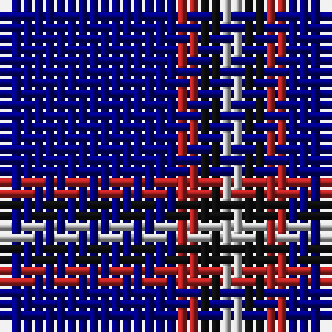

The parent of this is [Kucher, Gregory](/tartans/db/16/r2/k2/n/2/)

This was sourced from register-of-tartans.  It is a [4 stripes tartan](/stripes/stripes4/).

Original link https://www.tartanregister.gov.uk/tartanDetails.aspx?ref=10086

## Thread count
DB/16 R2 K2 N/2

## Palette
Each colour and its ΔE from the base-6 reference it is a variant of.

| Colour | Shade | Base | ΔE (OKLab) |
|---|---|---|---|
| DB |  `#000080` | B  | 0.14 |
| K |  `#101010` | K  | 0.17 |
| N |  `#BEBEBE` | W  | 0.16 |
| R |  `#B22222` | R  | 0.04 |

# Sample pattern

ID: /variants/db/16/r2/k2/n/2-db000080-k101010-nbebebe-rb22222/
