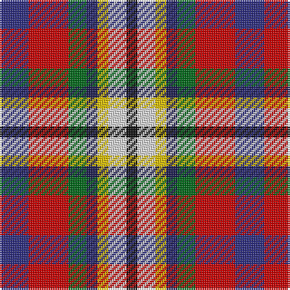

The parent of this is [Nicolson of Assynt & Coigach (Name)](/tartans/db/16/r22/g10/dba6/y6/ln10/k/6/)

This was sourced from tartans-authority.  It is a [7 stripes tartan](/stripes/stripes7/).

Original link http://www.tartansauthority.com/tartan-ferret/display/7786/

## Thread count
DB/16 R22 G10 DBa6 Y6 LN10 K/6

## Palette
Each colour and its ΔE from the base-6 reference it is a variant of.

| Colour | Shade | Base | ΔE (OKLab) |
|---|---|---|---|
| DB |  `#2C2C80` | B  | 0.05 |
| DBa |  `#1C1C50` | B  | 0.14 |
| G |  `#006818` | G  | 0.02 |
| K |  `#101010` | K  | 0.17 |
| LN |  `#E0E0E0` | W  | 0.06 |
| R |  `#C80000` | R  | 0.00 |
| Y |  `#E8C000` | Y  | 0.00 |

# Sample pattern

ID: /variants/db/16/r22/g10/dba6/y6/ln10/k/6-db2c2c80-dba1c1c50-g006818-k101010-lne0e0e0-rc80000-ye8c000/
