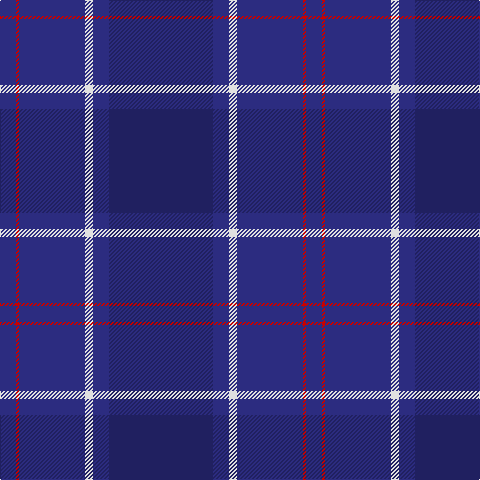

The parent of this is [Edzell U.S. Navy Regimental Tartan Tartan Number: 81. Earliest known date: pre 2003 Designed by Mr Arthur MacKie See products available Copyright © Blair Urquhart, Comrie, 2015](/tartans/db/16/r3/db66/ln8/db16/dba/104/)

This was sourced from house-of-tartan.  It is a [6 stripes tartan](/stripes/stripes6/).

Original link http://www.house-of-tartan.scotland.net/house/TartanViewjs.asp?colr=Def&tnam=81

## Thread count
DB/16 R3 DB66 LN8 DB16 DBa/104

## Palette
Each colour and its ΔE from the base-6 reference it is a variant of.

| Colour | Shade | Base | ΔE (OKLab) |
|---|---|---|---|
| DB |  `#2C2C80` | B  | 0.05 |
| DBa |  `#202060` | B  | 0.11 |
| LN |  `#E0E0E0` | W  | 0.06 |
| R |  `#C80000` | R  | 0.00 |

# Sample pattern

ID: /variants/db/16/r3/db66/ln8/db16/dba/104-db2c2c80-dba202060-lne0e0e0-rc80000/
