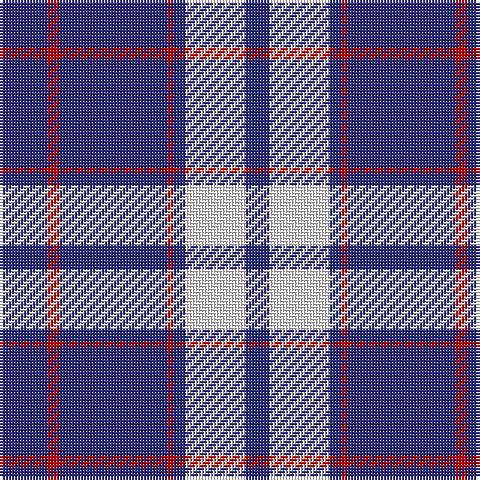

The parent of this is [Nike ACG Lunarstorm (Fashion)](/tartans/db/16/r4/db36/r2/db4/w20/db/8/)

This was sourced from tartans-authority.  It is a [7 stripes tartan](/stripes/stripes7/).

Original link http://www.tartansauthority.com/tartan-ferret/display/8354/

## Thread count
DB/16 R4 DB36 R2 DB4 W20 DB/8

## Palette
Each colour and its ΔE from the base-6 reference it is a variant of.

| Colour | Shade | Base | ΔE (OKLab) |
|---|---|---|---|
| DB |  `#2C2C80` | B  | 0.05 |
| R |  `#C80000` | R  | 0.00 |
| W |  `#F8F8F8` | W  | 0.01 |

# Sample pattern

ID: /variants/db/16/r4/db36/r2/db4/w20/db/8-db2c2c80-rc80000-wf8f8f8/
