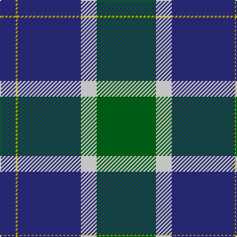

The parent of this is [Wimbledon](/tartans/db/16/y2/db64/w16/g/60/)

This was sourced from register-of-tartans.  It is a [5 stripes tartan](/stripes/stripes5/).

Original link https://www.tartanregister.gov.uk/tartanDetails.aspx?ref=3714

## Thread count
DB/16 Y2 DB64 W16 G/60

## Palette
Each colour and its ΔE from the base-6 reference it is a variant of.

| Colour | Shade | Base | ΔE (OKLab) |
|---|---|---|---|
| DB |  `#2C2C80` | B  | 0.05 |
| G |  `#006818` | G  | 0.02 |
| W |  `#FCFCFC` | W  | 0.03 |
| Y |  `#E8C000` | Y  | 0.00 |

# Sample pattern

ID: /variants/db/16/y2/db64/w16/g/60-db2c2c80-g006818-wfcfcfc-ye8c000/
