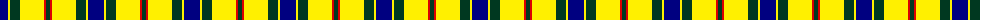
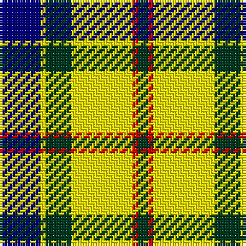

The parent of this is [McCabe (2016)](/tartans/db/16/y2/dg10/y24/r2/dg/4/)

This was sourced from register-of-tartans.  It is a [6 stripes tartan](/stripes/stripes6/).

Original link https://www.tartanregister.gov.uk/tartanDetails.aspx?ref=11461

## Thread count
DB/16 Y2 DG10 Y24 R2 DG/4

## Palette
Each colour and its ΔE from the base-6 reference it is a variant of.

| Colour | Shade | Base | ΔE (OKLab) |
|---|---|---|---|
| DB |  `#000080` | B  | 0.14 |
| DG |  `#003820` | G  | 0.16 |
| R |  `#DC0000` | R  | 0.04 |
| Y |  `#FFF000` | Y  | 0.13 |

# Sample pattern

ID: /variants/db/16/y2/dg10/y24/r2/dg/4-db000080-dg003820-rdc0000-yfff000/
