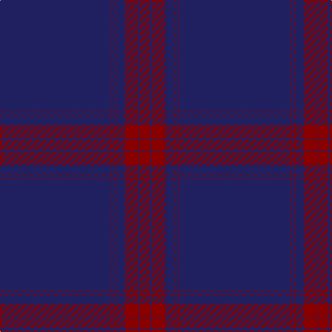

The parent of this is [Mack of Stoneywood Dress (Personal)](/tartans/db/160/dr2/db4/dr2/db12/dr20/db2/dr/14/)

This was sourced from tartans-authority.  It is a [8 stripes tartan](/stripes/stripes8/).

Original link http://www.tartansauthority.com/tartan-ferret/display/10795/

## Thread count
DB/160 DR2 DB4 DR2 DB12 DR20 DB2 DR/14

## Palette
Each colour and its ΔE from the base-6 reference it is a variant of.

| Colour | Shade | Base | ΔE (OKLab) |
|---|---|---|---|
| DB |  `#202060` | B  | 0.11 |
| DR |  `#880000` | R  | 0.14 |

# Sample pattern

ID: /variants/db/160/dr2/db4/dr2/db12/dr20/db2/dr/14-db202060-dr880000/
