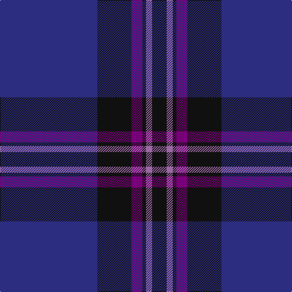

The parent of this is [Earl Blue Marl (Fashion)](/tartans/db/160/k56/p18/k6/lp10/k/24/)

This was sourced from tartans-authority.  It is a [6 stripes tartan](/stripes/stripes6/).

Original link http://www.tartansauthority.com/tartan-ferret/display/6867/

## Thread count
DB/160 K56 P18 K6 LP10 K/24

## Palette
Each colour and its ΔE from the base-6 reference it is a variant of.

| Colour | Shade | Base | ΔE (OKLab) |
|---|---|---|---|
| DB |  `#2C2C80` | B  | 0.05 |
| K |  `#101010` | K  | 0.17 |
| LP |  `#9C68A4` | R  | 0.21 |
| P |  `#780078` | B  | 0.16 |

# Sample pattern

ID: /variants/db/160/k56/p18/k6/lp10/k/24-db2c2c80-k101010-lp9c68a4-p780078/
