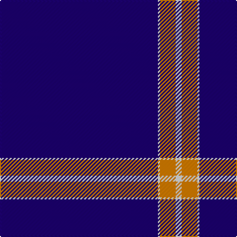

The parent of this is [Weir Minerals (Corporate)](/tartans/db/160/ln2/o16/ln/6/)

This was sourced from tartans-authority.  It is a [4 stripes tartan](/stripes/stripes4/).

Original link http://www.tartansauthority.com/tartan-ferret/display/7613/

## Thread count
DB/160 LN2 O16 LN/6

## Palette
Each colour and its ΔE from the base-6 reference it is a variant of.

| Colour | Shade | Base | ΔE (OKLab) |
|---|---|---|---|
| DB |  `#1C0070` | B  | 0.14 |
| LN |  `#E0E0E0` | W  | 0.06 |
| O |  `#D87C00` | Y  | 0.17 |

# Sample pattern

ID: /variants/db/160/ln2/o16/ln/6-db1c0070-lne0e0e0-od87c00/
