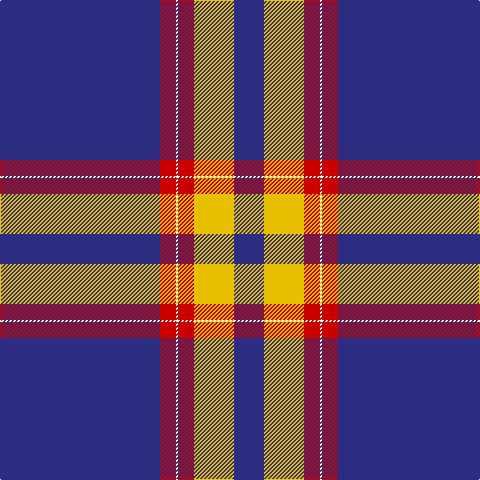

The parent of this is [Auchtermuchty Tartan Army](/tartans/db/160/r16/w2/r16/y40/db/30/)

This was sourced from register-of-tartans.  It is a [6 stripes tartan](/stripes/stripes6/).

Original link https://www.tartanregister.gov.uk/tartanDetails.aspx?ref=10197

## Thread count
DB/160 R16 W2 R16 Y40 DB/30

## Palette
Each colour and its ΔE from the base-6 reference it is a variant of.

| Colour | Shade | Base | ΔE (OKLab) |
|---|---|---|---|
| DB |  `#2C2C80` | B  | 0.05 |
| R |  `#C80000` | R  | 0.00 |
| W |  `#FFFFFF` | W  | 0.03 |
| Y |  `#E8C000` | Y  | 0.00 |

# Sample pattern

ID: /variants/db/160/r16/w2/r16/y40/db/30-db2c2c80-rc80000-wffffff-ye8c000/
