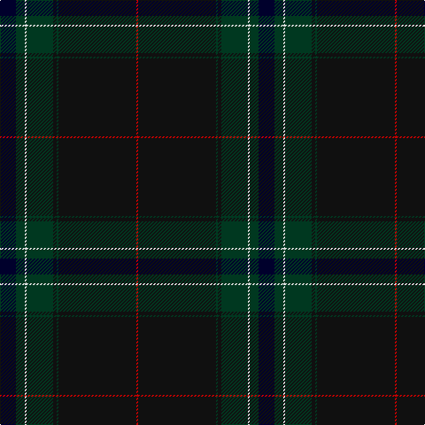

The parent of this is [Ata?, H.M. & I.C. (Personal)](/tartans/db/18/dg10/ln2/dg30/k4/dg2/k88/r/2/)

This was sourced from tartans-authority.  It is a [8 stripes tartan](/stripes/stripes8/).

Original link http://www.tartansauthority.com/tartan-ferret/display/10737/

## Thread count
DB/18 DG10 LN2 DG30 K4 DG2 K88 R/2

## Palette
Each colour and its ΔE from the base-6 reference it is a variant of.

| Colour | Shade | Base | ΔE (OKLab) |
|---|---|---|---|
| DB |  `#00002C` | K  | 0.16 |
| DG |  `#003820` | G  | 0.16 |
| K |  `#101010` | K  | 0.17 |
| LN |  `#E0E0E0` | W  | 0.06 |
| R |  `#C80000` | R  | 0.00 |

# Sample pattern

ID: /variants/db/18/dg10/ln2/dg30/k4/dg2/k88/r/2-db00002c-dg003820-k101010-lne0e0e0-rc80000/
