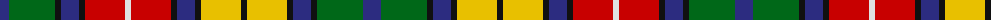

The parent of this is [Buchanan (Miller & Lang) Clan Tartan Tartan Number: 151. Earliest known date: 1930 Millar and Lang's Scottish Tartans See products available Copyright © Blair Urquhart, Comrie, 2015](/tartans/db/18/g46/k6/db18/k6/r40/ln6/r40/k6/db18/k6/y40/k6/y40/k6/db18/k6/g46/db/18/)

This was sourced from house-of-tartan.  It is a [19 stripes tartan](/stripes/stripes19/).

Original link http://www.house-of-tartan.scotland.net/house/TartanViewjs.asp?colr=Def&tnam=151

## Thread count
DB/18 G46 K6 DB18 K6 R40 LN6 R40 K6 DB18 K6 Y40 K6 Y40 K6 DB18 K6 G46 DB/18

## Palette
Each colour and its ΔE from the base-6 reference it is a variant of.

| Colour | Shade | Base | ΔE (OKLab) |
|---|---|---|---|
| DB |  `#2C2C80` | B  | 0.05 |
| G |  `#006818` | G  | 0.02 |
| K |  `#101010` | K  | 0.17 |
| LN |  `#E0E0E0` | W  | 0.06 |
| R |  `#C80000` | R  | 0.00 |
| Y |  `#E8C000` | Y  | 0.00 |

ID: /variants/db/18/g46/k6/db18/k6/r40/ln6/r40/k6/db18/k6/y40/k6/y40/k6/db18/k6/g46/db/18-db2c2c80-g006818-k101010-lne0e0e0-rc80000-ye8c000/
