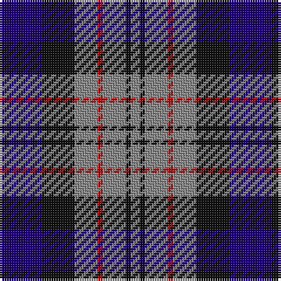

The parent of this is [Greyhound Grenadiers (Corporate)](/tartans/db/18/k14/n10/r2/n10/k2/n/4/)

This was sourced from tartans-authority.  It is a [7 stripes tartan](/stripes/stripes7/).

Original link http://www.tartansauthority.com/tartan-ferret/display/5709/

## Thread count
DB/18 K14 N10 R2 N10 K2 N/4

## Palette
Each colour and its ΔE from the base-6 reference it is a variant of.

| Colour | Shade | Base | ΔE (OKLab) |
|---|---|---|---|
| DB |  `#1C0070` | B  | 0.14 |
| K |  `#101010` | K  | 0.17 |
| N |  `#888888` | R  | 0.24 |
| R |  `#C80000` | R  | 0.00 |

# Sample pattern

ID: /variants/db/18/k14/n10/r2/n10/k2/n/4-db1c0070-k101010-n888888-rc80000/
