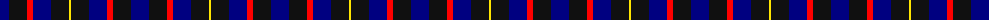
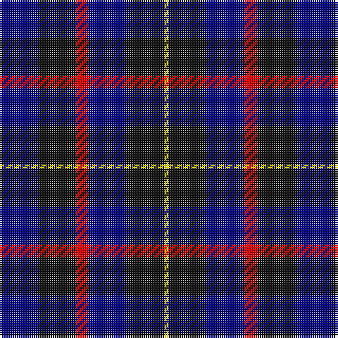

The parent of this is [Old Brigade Corporate Tartan Tartan Number: 10718. Earliest known date: 12/10/12 This tartan was designed to celebrate the 25th anniversary of the formation of the Old Brigade an informal fraternal society dedicated to good fellowship, formed in 1987. The colours relate to the regiment in which the founding members of the society were serving at the time, with the addition of a gold stripe for excellence. See products available Copyright © Blair Urquhart, Comrie, 2015](/tartans/db/18/k18/r6/db18/k18/y/2/)

This was sourced from house-of-tartan.  It is a [6 stripes tartan](/stripes/stripes6/).

Original link http://www.house-of-tartan.scotland.net/house/TartanViewjs.asp?colr=Def&tnam=10718

## Thread count
DB/18 K18 R6 DB18 K18 Y/2

## Palette
Each colour and its ΔE from the base-6 reference it is a variant of.

| Colour | Shade | Base | ΔE (OKLab) |
|---|---|---|---|
| DB |  `#000080` | B  | 0.14 |
| K |  `#101010` | K  | 0.17 |
| R |  `#FF0000` | R  | 0.11 |
| Y |  `#FFE600` | Y  | 0.10 |

# Sample pattern

ID: /variants/db/18/k18/r6/db18/k18/y/2-db000080-k101010-rff0000-yffe600/
