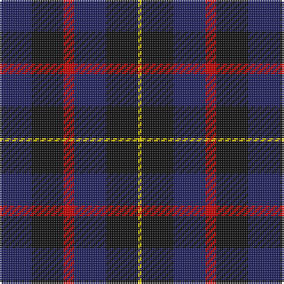

The parent of this is [Old Brigade](/tartans/db/18/k18/r6/db18/k18/y/2/)

This was sourced from tartans-authority.  It is a [6 stripes tartan](/stripes/stripes6/).

Original link http://www.tartansauthority.com/tartan-ferret/display/10718/

## Thread count
DB/18 K18 R6 DB18 K18 Y/2

## Palette
Each colour and its ΔE from the base-6 reference it is a variant of.

| Colour | Shade | Base | ΔE (OKLab) |
|---|---|---|---|
| DB |  `#202060` | B  | 0.11 |
| K |  `#101010` | K  | 0.17 |
| R |  `#C80000` | R  | 0.00 |
| Y |  `#FCCC00` | Y  | 0.04 |

# Sample pattern

ID: /variants/db/18/k18/r6/db18/k18/y/2-db202060-k101010-rc80000-yfccc00/
