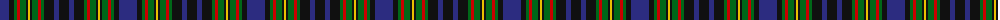

The parent of this is [MacClellan Clan Tartan Tartan Number: 325. Earliest known date: pre 2003 The Setts No: 105. Wilson's of Bannockburn produced this pattern in a variety of colours. Wilson called the pattern No. 64 or 'Abercrombie'. See products available Copyright © Blair Urquhart, Comrie, 2015](/tartans/db/18/k5/g3/r3/g6/k2/y2/k2/g6/r3/g3/k10/db5/k/10/)

This was sourced from house-of-tartan.  It is a [14 stripes tartan](/stripes/stripes14/).

Original link http://www.house-of-tartan.scotland.net/house/TartanViewjs.asp?colr=Def&tnam=325

## Thread count
DB/18 K5 G3 R3 G6 K2 Y2 K2 G6 R3 G3 K10 DB5 K/10

## Palette
Each colour and its ΔE from the base-6 reference it is a variant of.

| Colour | Shade | Base | ΔE (OKLab) |
|---|---|---|---|
| DB |  `#2C2C80` | B  | 0.05 |
| G |  `#006818` | G  | 0.02 |
| K |  `#101010` | K  | 0.17 |
| R |  `#C80000` | R  | 0.00 |
| Y |  `#E8C000` | Y  | 0.00 |

ID: /variants/db/18/k5/g3/r3/g6/k2/y2/k2/g6/r3/g3/k10/db5/k/10-db2c2c80-g006818-k101010-rc80000-ye8c000/
