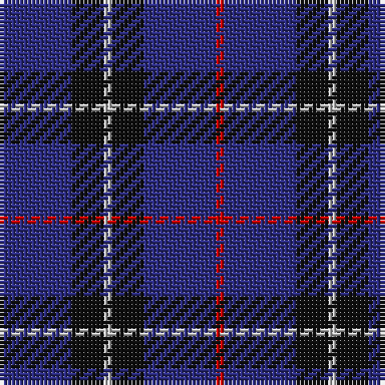

The parent of this is [Scottish Nuclear](/tartans/db/18/k8/n2/k8/db18/r/2/)

This was sourced from register-of-tartans.  It is a [6 stripes tartan](/stripes/stripes6/).

Original link https://www.tartanregister.gov.uk/tartanDetails.aspx?ref=3736

## Thread count
DB/18 K8 N2 K8 DB18 R/2

## Palette
Each colour and its ΔE from the base-6 reference it is a variant of.

| Colour | Shade | Base | ΔE (OKLab) |
|---|---|---|---|
| DB |  `#2C2C80` | B  | 0.05 |
| DBa |  `#1C0070` | B  | 0.14 |
| DR |  `#880000` | R  | 0.14 |
| K |  `#101010` | K  | 0.17 |
| N |  `#C0C0C0` | W  | 0.16 |
| R |  `#C80000` | R  | 0.00 |

# Sample pattern

ID: /variants/db/18/k8/n2/k8/db18/r/2-db2c2c80-dba1c0070-dr880000-k101010-nc0c0c0-rc80000/
