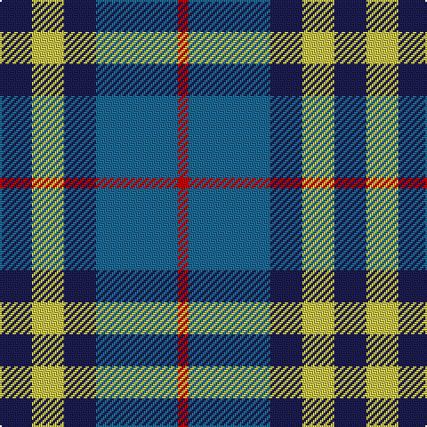

The parent of this is [Tilburg (District)](/tartans/db/18/lg18/db18/b46/r/6/)

This was sourced from tartans-authority.  It is a [5 stripes tartan](/stripes/stripes5/).

Original link http://www.tartansauthority.com/tartan-ferret/display/7464/

## Thread count
DB/18 LG18 DB18 B46 R/6

## Palette
Each colour and its ΔE from the base-6 reference it is a variant of.

| Colour | Shade | Base | ΔE (OKLab) |
|---|---|---|---|
| B |  `#1C6894` | B  | 0.11 |
| DB |  `#1C1C50` | B  | 0.14 |
| LG |  `#C8C44C` | Y  | 0.05 |
| R |  `#C80000` | R  | 0.00 |

# Sample pattern

ID: /variants/db/18/lg18/db18/b46/r/6-b1c6894-db1c1c50-lgc8c44c-rc80000/
