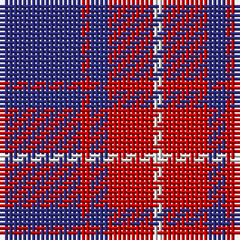

The parent of this is [McIntosh, Georgina (Personal)](/tartans/db/18/r2/dba4/r2/r8/ln/2/)

This was sourced from tartans-authority.  It is a [6 stripes tartan](/stripes/stripes6/).

Original link http://www.tartansauthority.com/tartan-ferret/display/7953/

## Thread count
DB/18 R2 DBa4 R2 R8 LN/2

## Palette
Each colour and its ΔE from the base-6 reference it is a variant of.

| Colour | Shade | Base | ΔE (OKLab) |
|---|---|---|---|
| DB |  `#2C2C80` | B  | 0.05 |
| DBa |  `#2C2C80` | B  | 0.05 |
| LN |  `#E0E0E0` | W  | 0.06 |
| R |  `#C80000` | R  | 0.00 |

# Sample pattern

ID: /variants/db/18/r2/dba4/r2/r8/ln/2-db2c2c80-dba2c2c80-lne0e0e0-rc80000/
