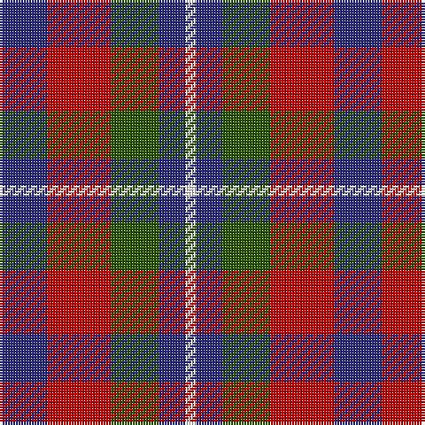

The parent of this is [Battle of Prestonpans (1745) Herit](/tartans/db/18/r24/g18/db10/w/4/)

This was sourced from tartans-authority.  It is a [5 stripes tartan](/stripes/stripes5/).

Original link http://www.tartansauthority.com/tartan-ferret/display/10841/

## Thread count
DB/18 R24 G18 DB10 W/4

## Palette
Each colour and its ΔE from the base-6 reference it is a variant of.

| Colour | Shade | Base | ΔE (OKLab) |
|---|---|---|---|
| DB |  `#2C2C80` | B  | 0.05 |
| G |  `#285800` | G  | 0.04 |
| R |  `#C80000` | R  | 0.00 |
| W |  `#FCFCFC` | W  | 0.03 |

# Sample pattern

ID: /variants/db/18/r24/g18/db10/w/4-db2c2c80-g285800-rc80000-wfcfcfc/
