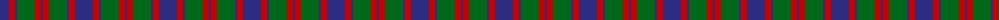
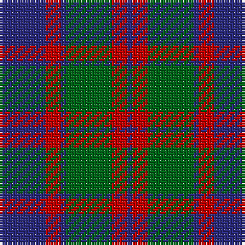

The parent of this is [Logan #5](/tartans/db/18/r6/db2/g18/r6/db/2/)

This was sourced from register-of-tartans.  It is a [6 stripes tartan](/stripes/stripes6/).

Original link https://www.tartanregister.gov.uk/tartanDetails.aspx?ref=2185

## Thread count
DB/18 R6 DB2 G18 R6 DB/2

## Palette
Each colour and its ΔE from the base-6 reference it is a variant of.

| Colour | Shade | Base | ΔE (OKLab) |
|---|---|---|---|
| DB |  `#2C2C80` | B  | 0.05 |
| G |  `#006818` | G  | 0.02 |
| R |  `#C80000` | R  | 0.00 |

# Sample pattern

ID: /variants/db/18/r6/db2/g18/r6/db/2-db2c2c80-g006818-rc80000/
