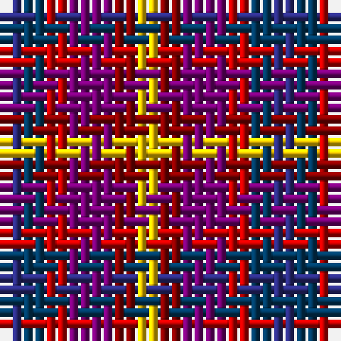

The parent of this is [Lytley Formal (Personal)](/tartans/db/2/dba2/r2/p4/dr2/y/2/)

This was sourced from tartans-authority.  It is a [6 stripes tartan](/stripes/stripes6/).

Original link http://www.tartansauthority.com/tartan-ferret/display/10476/

## Thread count
DB/2 DBa2 R2 P4 DR2 Y/2

## Palette
Each colour and its ΔE from the base-6 reference it is a variant of.

| Colour | Shade | Base | ΔE (OKLab) |
|---|---|---|---|
| DB |  `#2C2C80` | B  | 0.05 |
| DBa |  `#003C64` | B  | 0.07 |
| DR |  `#880000` | R  | 0.14 |
| P |  `#780078` | B  | 0.16 |
| R |  `#C80000` | R  | 0.00 |
| Y |  `#FCCC00` | Y  | 0.04 |

# Sample pattern

ID: /variants/db/2/dba2/r2/p4/dr2/y/2-db2c2c80-dba003c64-dr880000-p780078-rc80000-yfccc00/
