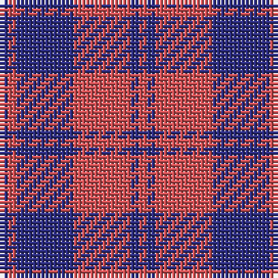

The parent of this is [MacGregor of Glengyle - 1750 (Clan)](/tartans/db/2/do2/db14/do14/db2/do/2/)

This was sourced from tartans-authority.  It is a [6 stripes tartan](/stripes/stripes6/).

Original link http://www.tartansauthority.com/tartan-ferret/display/450/

## Thread count
DB/2 DO2 DB14 DO14 DB2 DO/2

## Palette
Each colour and its ΔE from the base-6 reference it is a variant of.

| Colour | Shade | Base | ΔE (OKLab) |
|---|---|---|---|
| DB |  `#2C2C80` | B  | 0.05 |
| DO |  `#D05054` | R  | 0.10 |

# Sample pattern

ID: /variants/db/2/do2/db14/do14/db2/do/2-db2c2c80-dod05054/
