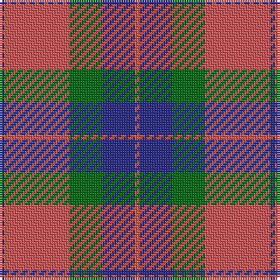

The parent of this is [Fraser of Boblainy, Hugh](/tartans/db/2/do28/g14/db14/do/2/)

This was sourced from register-of-tartans.  It is a [5 stripes tartan](/stripes/stripes5/).

Original link https://www.tartanregister.gov.uk/tartanDetails.aspx?ref=1263

## Thread count
DB/2 DO28 G14 DB14 DO/2

## Palette
Each colour and its ΔE from the base-6 reference it is a variant of.

| Colour | Shade | Base | ΔE (OKLab) |
|---|---|---|---|
| DB |  `#2C2C80` | B  | 0.05 |
| DO |  `#C85858` | R  | 0.11 |
| G |  `#006818` | G  | 0.02 |

# Sample pattern

ID: /variants/db/2/do28/g14/db14/do/2-db2c2c80-doc85858-g006818/
