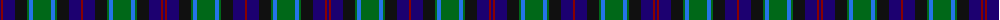

The parent of this is [MacTaggart (Johnstons)](/tartans/db/2/dr2/db12/k12/g2/b4/g18/b4/g2/k12/db12/dr/2/)

This was sourced from register-of-tartans.  It is a [12 stripes tartan](/stripes/stripes12/).

Original link https://www.tartanregister.gov.uk/tartanDetails.aspx?ref=2767

## Thread count
DB/2 DR2 DB12 K12 G2 B4 G18 B4 G2 K12 DB12 DR/2

## Palette
Each colour and its ΔE from the base-6 reference it is a variant of.

| Colour | Shade | Base | ΔE (OKLab) |
|---|---|---|---|
| B |  `#2474E8` | B  | 0.20 |
| DB |  `#1C0070` | B  | 0.14 |
| DR |  `#880000` | R  | 0.14 |
| G |  `#006818` | G  | 0.02 |
| K |  `#101010` | K  | 0.17 |

ID: /variants/db/2/dr2/db12/k12/g2/b4/g18/b4/g2/k12/db12/dr/2-b2474e8-db1c0070-dr880000-g006818-k101010/
