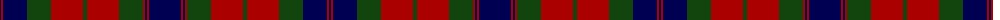

The parent of this is [Fraser](/tartans/db/2/dr2/db24/dg24/dr32/dg4/dr32/dg24/dr2/db2/dr2/db/32/)

This was sourced from weddslist.  It is a [12 stripes tartan](/stripes/stripes12/).

Original link http://www.weddslist.com/cgi-bin/tartans/pg.pl?source=x

## Thread count
DB/2 DR2 DB24 DG24 DR32 DG4 DR32 DG24 DR2 DB2 DR2 DB/32

## Palette
Each colour and its ΔE from the base-6 reference it is a variant of.

| Colour | Shade | Base | ΔE (OKLab) |
|---|---|---|---|
| DB |  `#000052` | B  | 0.20 |
| DG |  `#11450D` | G  | 0.10 |
| DR |  `#AA0000` | R  | 0.06 |

ID: /variants/db/2/dr2/db24/dg24/dr32/dg4/dr32/dg24/dr2/db2/dr2/db/32-db000052-dg11450d-draa0000/
