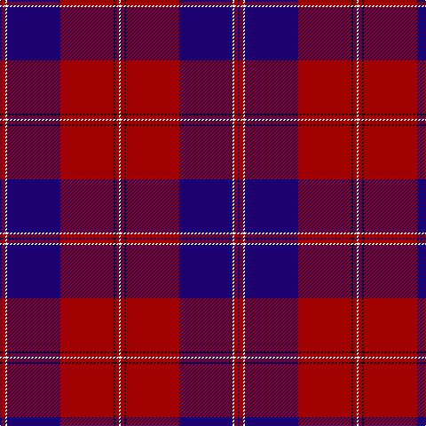

The parent of this is [Knights Templar - Grand Priory (Corp](/tartans/db/2/dr4/w2/db60/dr60/k2/dr4/w/2/)

This was sourced from tartans-authority.  It is a [8 stripes tartan](/stripes/stripes8/).

Original link http://www.tartansauthority.com/tartan-ferret/display/5370/

## Thread count
DB/2 DR4 W2 DB60 DR60 K2 DR4 W/2

## Palette
Each colour and its ΔE from the base-6 reference it is a variant of.

| Colour | Shade | Base | ΔE (OKLab) |
|---|---|---|---|
| DB |  `#1C0070` | B  | 0.14 |
| DR |  `#A00000` | R  | 0.09 |
| K |  `#101010` | K  | 0.17 |
| W |  `#FCFCFC` | W  | 0.03 |

# Sample pattern

ID: /variants/db/2/dr4/w2/db60/dr60/k2/dr4/w/2-db1c0070-dra00000-k101010-wfcfcfc/
