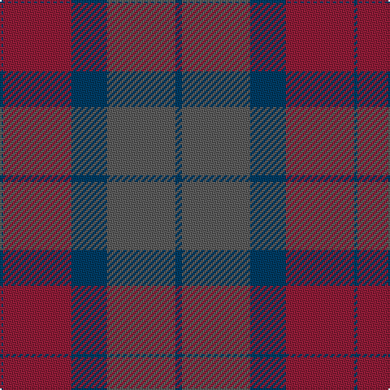

The parent of this is [Romanes Check (Fashion)](/tartans/db/2/dr42/db22/n42/db/4/)

This was sourced from tartans-authority.  It is a [5 stripes tartan](/stripes/stripes5/).

Original link http://www.tartansauthority.com/tartan-ferret/display/8145/

## Thread count
DB/2 DR42 DB22 N42 DB/4

## Palette
Each colour and its ΔE from the base-6 reference it is a variant of.

| Colour | Shade | Base | ΔE (OKLab) |
|---|---|---|---|
| DB |  `#003C64` | B  | 0.07 |
| DR |  `#901C38` | R  | 0.12 |
| N |  `#5C5C5C` | B  | 0.14 |

# Sample pattern

ID: /variants/db/2/dr42/db22/n42/db/4-db003c64-dr901c38-n5c5c5c/
