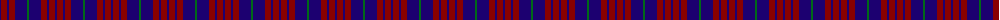
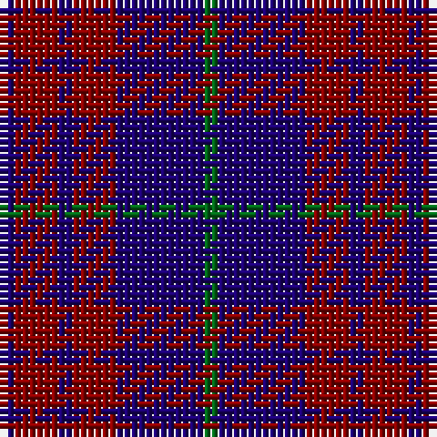

The parent of this is [Robbins (Name)](/tartans/db/2/dr6/db2/dr6/db12/g/2/)

This was sourced from tartans-authority.  It is a [6 stripes tartan](/stripes/stripes6/).

Original link http://www.tartansauthority.com/tartan-ferret/display/412/

## Thread count
DB/2 DR6 DB2 DR6 DB12 G/2

## Palette
Each colour and its ΔE from the base-6 reference it is a variant of.

| Colour | Shade | Base | ΔE (OKLab) |
|---|---|---|---|
| DB |  `#1C0070` | B  | 0.14 |
| DR |  `#880000` | R  | 0.14 |
| G |  `#006818` | G  | 0.02 |

# Sample pattern

ID: /variants/db/2/dr6/db2/dr6/db12/g/2-db1c0070-dr880000-g006818/
