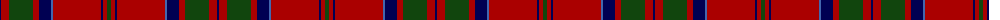

The parent of this is [MacDonell of Keppoch](/tartans/db/2/dr8/dg24/dr6/db12/b2/dr48/db2/dr4/dg/4/)

This was sourced from weddslist.  It is a [10 stripes tartan](/stripes/stripes10/).

Original link http://www.weddslist.com/cgi-bin/tartans/pg.pl?source=tinsel

## Thread count
DB/2 DR8 DG24 DR6 DB12 B2 DR48 DB2 DR4 DG/4

## Palette
Each colour and its ΔE from the base-6 reference it is a variant of.

| Colour | Shade | Base | ΔE (OKLab) |
|---|---|---|---|
| B |  `#4367AE` | B  | 0.13 |
| DB |  `#000052` | B  | 0.20 |
| DG |  `#11450D` | G  | 0.10 |
| DR |  `#AA0000` | R  | 0.06 |

ID: /variants/db/2/dr8/dg24/dr6/db12/b2/dr48/db2/dr4/dg/4-b4367ae-db000052-dg11450d-draa0000/
