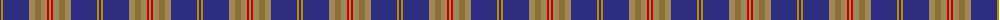
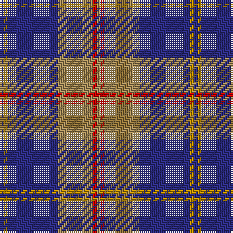

The parent of this is [Glen Moray (Corporate)](/tartans/db/2/dy2/db26/lt6/lta6/lt6/r2/lt/2/)

This was sourced from tartans-authority.  It is a [8 stripes tartan](/stripes/stripes8/).

Original link http://www.tartansauthority.com/tartan-ferret/display/6249/

## Thread count
DB/2 DY2 DB26 LT6 LTa6 LT6 R2 LT/2

## Palette
Each colour and its ΔE from the base-6 reference it is a variant of.

| Colour | Shade | Base | ΔE (OKLab) |
|---|---|---|---|
| DB |  `#2C2C80` | B  | 0.05 |
| DY |  `#BC8C00` | Y  | 0.16 |
| LT |  `#A08858` | Y  | 0.21 |
| LTa |  `#8C7038` | G  | 0.18 |
| R |  `#C80000` | R  | 0.00 |

# Sample pattern

ID: /variants/db/2/dy2/db26/lt6/lta6/lt6/r2/lt/2-db2c2c80-dybc8c00-lta08858-lta8c7038-rc80000/
