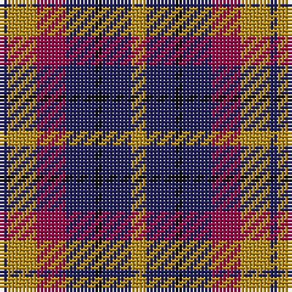

The parent of this is [Isle of Gigha (District)](/tartans/db/2/dy8/r8/dba8/k2/dba8/dy/4/)

This was sourced from tartans-authority.  It is a [7 stripes tartan](/stripes/stripes7/).

Original link http://www.tartansauthority.com/tartan-ferret/display/3085/

## Thread count
DB/2 DY8 R8 DBa8 K2 DBa8 DY/4

## Palette
Each colour and its ΔE from the base-6 reference it is a variant of.

| Colour | Shade | Base | ΔE (OKLab) |
|---|---|---|---|
| DB |  `#202060` | B  | 0.11 |
| DBa |  `#202060` | B  | 0.11 |
| DY |  `#BC8C00` | Y  | 0.16 |
| K |  `#101010` | K  | 0.17 |
| R |  `#A00048` | R  | 0.11 |

# Sample pattern

ID: /variants/db/2/dy8/r8/dba8/k2/dba8/dy/4-db202060-dba202060-dybc8c00-k101010-ra00048/
