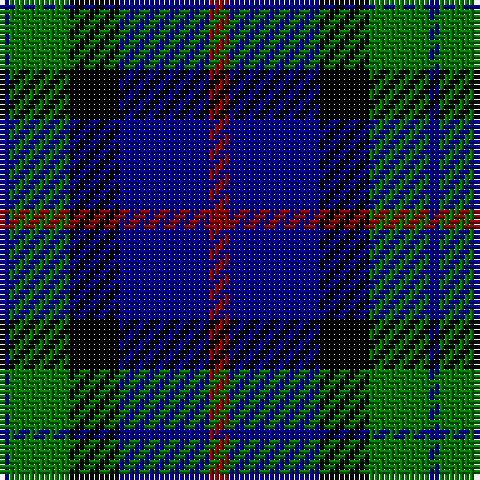

The parent of this is [Frobo Nairn](/tartans/db/2/g12/k10/db18/dr/4/)

This was sourced from register-of-tartans.  It is a [5 stripes tartan](/stripes/stripes5/).

Original link https://www.tartanregister.gov.uk/tartanDetails.aspx?ref=1283

## Thread count
DB/2 G12 K10 DB18 DR/4

## Palette
Each colour and its ΔE from the base-6 reference it is a variant of.

| Colour | Shade | Base | ΔE (OKLab) |
|---|---|---|---|
| DB |  `#00008C` | B  | 0.13 |
| DR |  `#8C0000` | R  | 0.13 |
| G |  `#007800` | G  | 0.06 |
| K |  `#000000` | K  | 0.00 |

# Sample pattern

ID: /variants/db/2/g12/k10/db18/dr/4-db00008c-dr8c0000-g007800-k000000/
