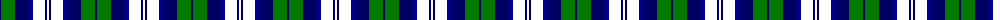
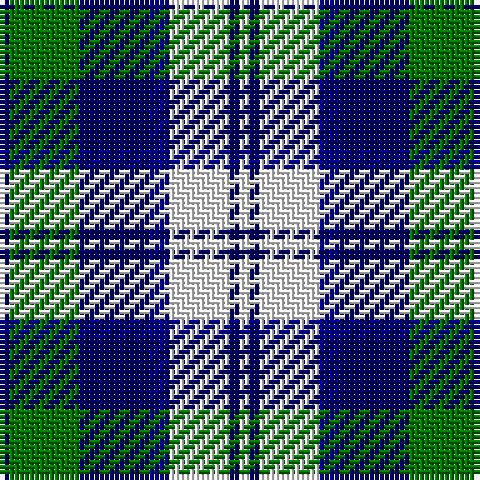

The parent of this is [Blue Boy, The](/tartans/db/2/g14/db14/dba4/w12/db2/w/2/)

This was sourced from register-of-tartans.  It is a [7 stripes tartan](/stripes/stripes7/).

Original link https://www.tartanregister.gov.uk/tartanDetails.aspx?ref=5371

## Thread count
DB/2 G14 DB14 DBa4 W12 DB2 W/2

## Palette
Each colour and its ΔE from the base-6 reference it is a variant of.

| Colour | Shade | Base | ΔE (OKLab) |
|---|---|---|---|
| DB |  `#000064` | B  | 0.17 |
| DBa |  `#00008C` | B  | 0.13 |
| G |  `#007800` | G  | 0.06 |
| W |  `#FFFFFF` | W  | 0.03 |

# Sample pattern

ID: /variants/db/2/g14/db14/dba4/w12/db2/w/2-db000064-dba00008c-g007800-wffffff/
