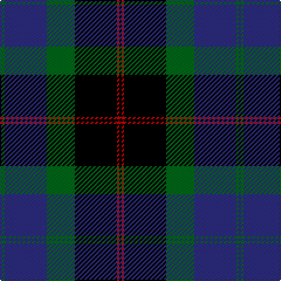

The parent of this is [Meoni (Name)](/tartans/db/2/g2/db36/g24/k36/r2/k/2/)

This was sourced from tartans-authority.  It is a [7 stripes tartan](/stripes/stripes7/).

Original link http://www.tartansauthority.com/tartan-ferret/display/4124/

## Thread count
DB/2 G2 DB36 G24 K36 R2 K/2

## Palette
Each colour and its ΔE from the base-6 reference it is a variant of.

| Colour | Shade | Base | ΔE (OKLab) |
|---|---|---|---|
| DB |  `#2C2C80` | B  | 0.05 |
| G |  `#006818` | G  | 0.02 |
| K |  `#000000` | K  | 0.00 |
| R |  `#C80000` | R  | 0.00 |

# Sample pattern

ID: /variants/db/2/g2/db36/g24/k36/r2/k/2-db2c2c80-g006818-k000000-rc80000/
