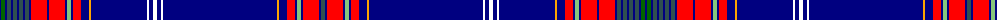

The parent of this is [New York Tartan Day Parade](/tartans/db/2/g4/db2/n4/db2/n4/db2/n4/db2/n4/db2/r16/db2/r16/db2/lg4/db2/r8/db8/y2/db56/w2/db4/w4/db4/w2/db114/y2/db8/r8/db2/lg4/db2/r16/db2/n/4/)

This was sourced from register-of-tartans.  It is a [36 stripes tartan](/stripes/stripes36/).

Original link https://www.tartanregister.gov.uk/tartanDetails.aspx?ref=10537

## Thread count
DB/2 G4 DB2 N4 DB2 N4 DB2 N4 DB2 N4 DB2 R16 DB2 R16 DB2 LG4 DB2 R8 DB8 Y2 DB56 W2 DB4 W4 DB4 W2 DB114 Y2 DB8 R8 DB2 LG4 DB2 R16 DB2 N/4

## Palette
Each colour and its ΔE from the base-6 reference it is a variant of.

| Colour | Shade | Base | ΔE (OKLab) |
|---|---|---|---|
| DB |  `#000080` | B  | 0.14 |
| G |  `#006400` | G  | 0.00 |
| LG |  `#86C67C` | Y  | 0.14 |
| N |  `#2F4F4F` | B  | 0.11 |
| R |  `#FF0000` | R  | 0.11 |
| W |  `#FFFFFF` | W  | 0.03 |
| Y |  `#FFA500` | Y  | 0.07 |

ID: /variants/db/2/g4/db2/n4/db2/n4/db2/n4/db2/n4/db2/r16/db2/r16/db2/lg4/db2/r8/db8/y2/db56/w2/db4/w4/db4/w2/db114/y2/db8/r8/db2/lg4/db2/r16/db2/n/4-db000080-g006400-lg86c67c-n2f4f4f-rff0000-wffffff-yffa500/
