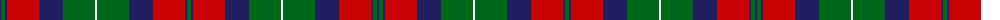

The parent of this is [Unidentified (1996)](/tartans/db/2/g4/db2/r32/db24/g32/w2/g32/db24/r32/db2/g/4/)

This was sourced from register-of-tartans.  It is a [12 stripes tartan](/stripes/stripes12/).

Original link https://www.tartanregister.gov.uk/tartanDetails.aspx?ref=5418

## Thread count
DB/2 G4 DB2 R32 DB24 G32 W2 G32 DB24 R32 DB2 G/4

## Palette
Each colour and its ΔE from the base-6 reference it is a variant of.

| Colour | Shade | Base | ΔE (OKLab) |
|---|---|---|---|
| DB |  `#202060` | B  | 0.11 |
| G |  `#006818` | G  | 0.02 |
| R |  `#C80000` | R  | 0.00 |
| W |  `#FCFCFC` | W  | 0.03 |

ID: /variants/db/2/g4/db2/r32/db24/g32/w2/g32/db24/r32/db2/g/4-db202060-g006818-rc80000-wfcfcfc/
