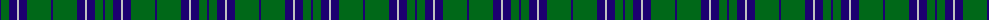
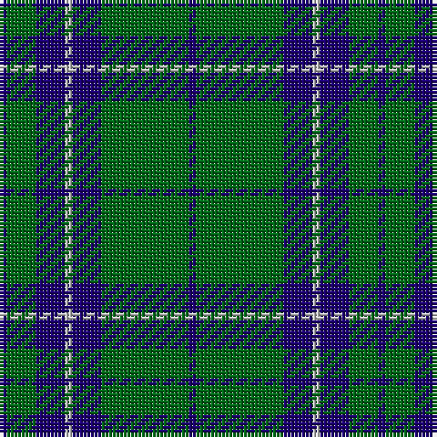

The parent of this is [St. Dennis & Cranley (Corporate)](/tartans/db/2/g8/db8/n2/db8/g24/db/2/)

This was sourced from tartans-authority.  It is a [7 stripes tartan](/stripes/stripes7/).

Original link http://www.tartansauthority.com/tartan-ferret/display/5310/

## Thread count
DB/2 G8 DB8 N2 DB8 G24 DB/2

## Palette
Each colour and its ΔE from the base-6 reference it is a variant of.

| Colour | Shade | Base | ΔE (OKLab) |
|---|---|---|---|
| DB |  `#1C0070` | B  | 0.14 |
| G |  `#006818` | G  | 0.02 |
| N |  `#C0C0C0` | W  | 0.16 |

# Sample pattern

ID: /variants/db/2/g8/db8/n2/db8/g24/db/2-db1c0070-g006818-nc0c0c0/
