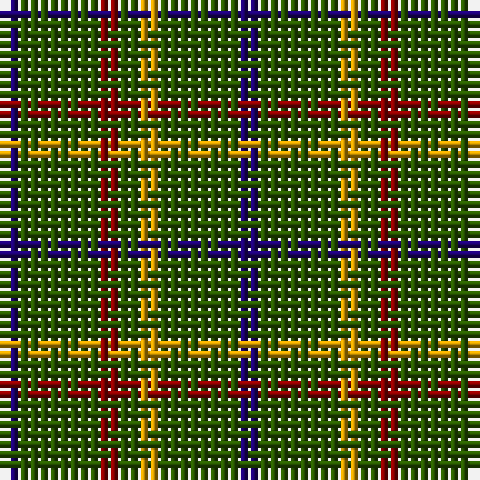

The parent of this is [Justus Htg (Personal)](/tartans/db/2/g8/dr2/g2/dy2/g8/db/2/)

This was sourced from tartans-authority.  It is a [7 stripes tartan](/stripes/stripes7/).

Original link http://www.tartansauthority.com/tartan-ferret/display/2499/

## Thread count
DB/2 G8 DR2 G2 DY2 G8 DB/2

## Palette
Each colour and its ΔE from the base-6 reference it is a variant of.

| Colour | Shade | Base | ΔE (OKLab) |
|---|---|---|---|
| DB |  `#1C0070` | B  | 0.14 |
| DR |  `#880000` | R  | 0.14 |
| DY |  `#D09800` | Y  | 0.11 |
| G |  `#285800` | G  | 0.04 |

# Sample pattern

ID: /variants/db/2/g8/dr2/g2/dy2/g8/db/2-db1c0070-dr880000-dyd09800-g285800/
