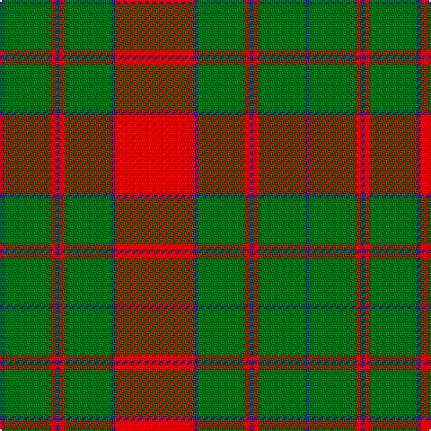

The parent of this is [Unidentified Cant #09](/tartans/db/2/ga26/r3/db2/r3/ga26/db2/r/44/)

This was sourced from register-of-tartans.  It is a [8 stripes tartan](/stripes/stripes8/).

Original link https://www.tartanregister.gov.uk/tartanDetails.aspx?ref=4909

## Thread count
DB/2 Ga26 R3 DB2 R3 Ga26 DB2 R/44

## Palette
Each colour and its ΔE from the base-6 reference it is a variant of.

| Colour | Shade | Base | ΔE (OKLab) |
|---|---|---|---|
| DB |  `#2C2C80` | B  | 0.05 |
| G |  `#285800` | G  | 0.04 |
| Ga |  `#006818` | G  | 0.02 |
| R |  `#C80000` | R  | 0.00 |

# Sample pattern

ID: /variants/db/2/ga26/r3/db2/r3/ga26/db2/r/44-db2c2c80-g285800-ga006818-rc80000/
