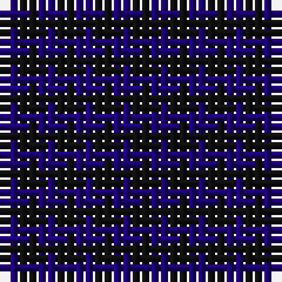

The parent of this is [Buffalo Plaid](/tartans/db/2/k/2/)

This was sourced from register-of-tartans.  It is a [2 stripes tartan](/stripes/stripes2/).

Original link https://www.tartanregister.gov.uk/tartanDetails.aspx?ref=5286

## Thread count
DB/2 K/2

## Palette
DB K

# Sample pattern

ID: /variants/db/2/k/2-db1c0070-k101010/
