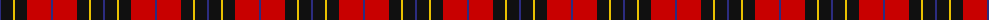
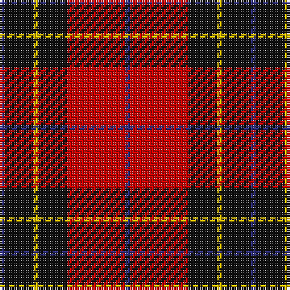

The parent of this is [Cetoloni (Personal)](/tartans/db/2/k12/y2/k12/r24/db/2/)

This was sourced from register-of-tartans.  It is a [6 stripes tartan](/stripes/stripes6/).

Original link https://www.tartanregister.gov.uk/tartanDetails.aspx?ref=612

## Thread count
DB/2 K12 Y2 K12 R24 DB/2

## Palette
Each colour and its ΔE from the base-6 reference it is a variant of.

| Colour | Shade | Base | ΔE (OKLab) |
|---|---|---|---|
| DB |  `#2C2C80` | B  | 0.05 |
| K |  `#101010` | K  | 0.17 |
| R |  `#C80000` | R  | 0.00 |
| Y |  `#E8C000` | Y  | 0.00 |

# Sample pattern

ID: /variants/db/2/k12/y2/k12/r24/db/2-db2c2c80-k101010-rc80000-ye8c000/
