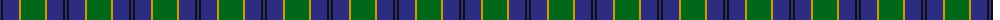
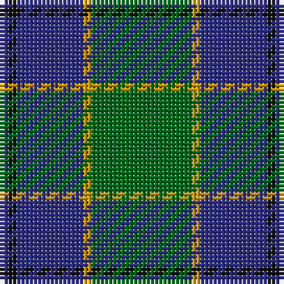

The parent of this is [Rowan (Personal)](/tartans/db/2/k2/db16/dy2/g/24/)

This was sourced from register-of-tartans.  It is a [5 stripes tartan](/stripes/stripes5/).

Original link https://www.tartanregister.gov.uk/tartanDetails.aspx?ref=3580

## Thread count
DB/2 K2 DB16 DY2 G/24

## Palette
Each colour and its ΔE from the base-6 reference it is a variant of.

| Colour | Shade | Base | ΔE (OKLab) |
|---|---|---|---|
| DB |  `#2C2C80` | B  | 0.05 |
| DY |  `#D09800` | Y  | 0.11 |
| G |  `#006818` | G  | 0.02 |
| K |  `#101010` | K  | 0.17 |

# Sample pattern

ID: /variants/db/2/k2/db16/dy2/g/24-db2c2c80-dyd09800-g006818-k101010/
