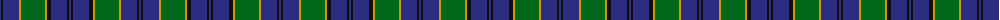

The parent of this is [Rowan (Name)](/tartans/db/2/k2/db16/dy2/g24/dy2/k4/db16/k2/db/2/)

This was sourced from tartans-authority.  It is a [10 stripes tartan](/stripes/stripes10/).

Original link http://www.tartansauthority.com/tartan-ferret/display/2067/

## Thread count
DB/2 K2 DB16 DY2 G24 DY2 K4 DB16 K2 DB/2

## Palette
Each colour and its ΔE from the base-6 reference it is a variant of.

| Colour | Shade | Base | ΔE (OKLab) |
|---|---|---|---|
| DB |  `#2C2C80` | B  | 0.05 |
| DY |  `#D09800` | Y  | 0.11 |
| G |  `#006818` | G  | 0.02 |
| K |  `#101010` | K  | 0.17 |

ID: /variants/db/2/k2/db16/dy2/g24/dy2/k4/db16/k2/db/2-db2c2c80-dyd09800-g006818-k101010/
