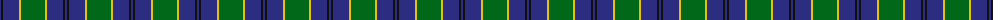

The parent of this is [Rowan Family Tartan Tartan Number: 2067. Earliest known date: 1990 Designed for Mr Robert Rowan. See products available Copyright © Blair Urquhart, Comrie, 2015](/tartans/db/2/k2/db16/y2/g24/y2/db16/k2/db/2/)

This was sourced from house-of-tartan.  It is a [9 stripes tartan](/stripes/stripes9/).

Original link http://www.house-of-tartan.scotland.net/house/TartanViewjs.asp?colr=Def&tnam=2067

## Thread count
DB/2 K2 DB16 Y2 G24 Y2 DB16 K2 DB/2

## Palette
Each colour and its ΔE from the base-6 reference it is a variant of.

| Colour | Shade | Base | ΔE (OKLab) |
|---|---|---|---|
| DB |  `#2C2C80` | B  | 0.05 |
| G |  `#006818` | G  | 0.02 |
| K |  `#101010` | K  | 0.17 |
| Y |  `#E8C000` | Y  | 0.00 |

ID: /variants/db/2/k2/db16/y2/g24/y2/db16/k2/db/2-db2c2c80-g006818-k101010-ye8c000/
